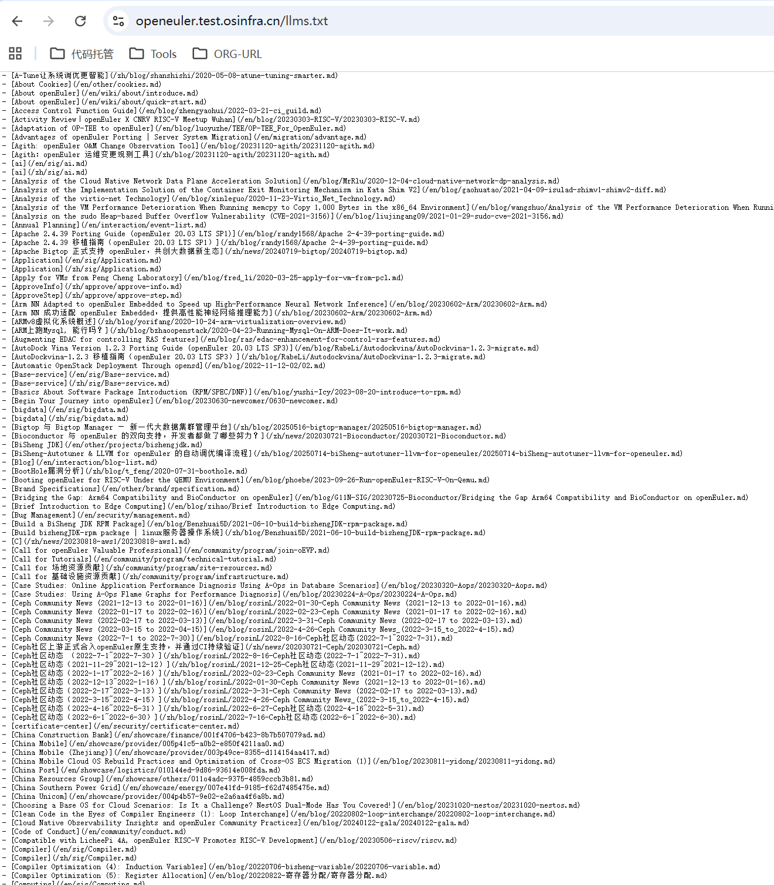
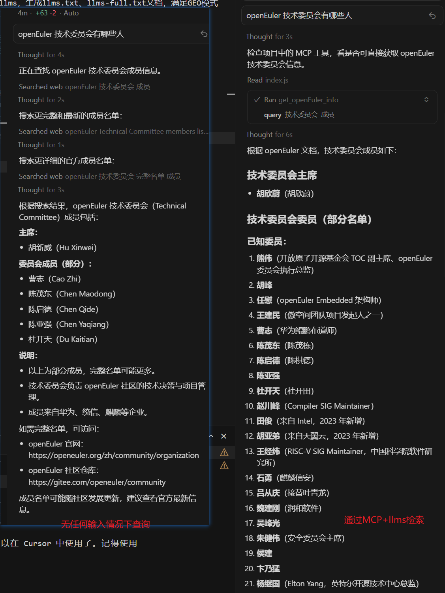

# 官网引入vitepress-plugin-llms，生成llms.txt、llms-full.txt文档，提升GEO模式下外部人员/工具检索官网信息列表及详情的能力。

[llms.txt](https://openeuler.test.osinfra.cn/llms.txt)
[llms-full.txt](https://openeuler.test.osinfra.cn/llms-full.txt)

# 搭建MCP服务，实现社区信息检索：
## Agent通过MCP检索生成的llms文档，查询社区相关信息：

相较于无输入，检索效果更好、更全面。

限制：社区信息多且杂、丢失部分语义，导致检索效果不好。

下一步：尝试精简llms信息收录；尝试结构化关键目标信息直接调用而非llms检索。

## Agent通过MCP调用相关接口，查询SIG组信息。
下一步：将相关信息结构化，以headless形式统一接口查询方式。
