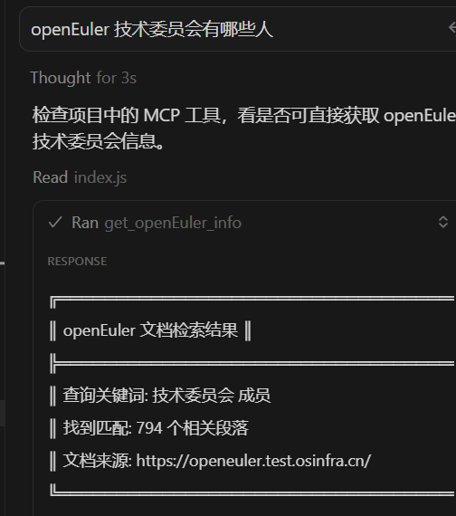
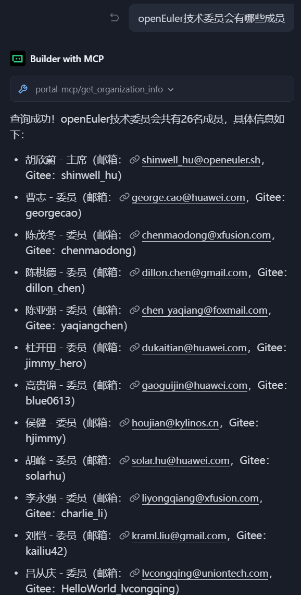

# 完善MCP服务，实现社区通过llms.txt、API、结构化数据三种场景的信息检索：
## 之前提到一个问题，因为MD信息不全、llms.txt数据过多导致检索效果不好。

通过结构化数据定向检索，从而提升检索效果：

## 下一步：完善关键用户场景的内容查询：SIG查询、文档查询、软件下载、CVE等关键路径。

# 在引入vitepress-plugin-llms的基础上，支持配置目标呈现内容，有利于排除低价值信息、快速识别关键信息。